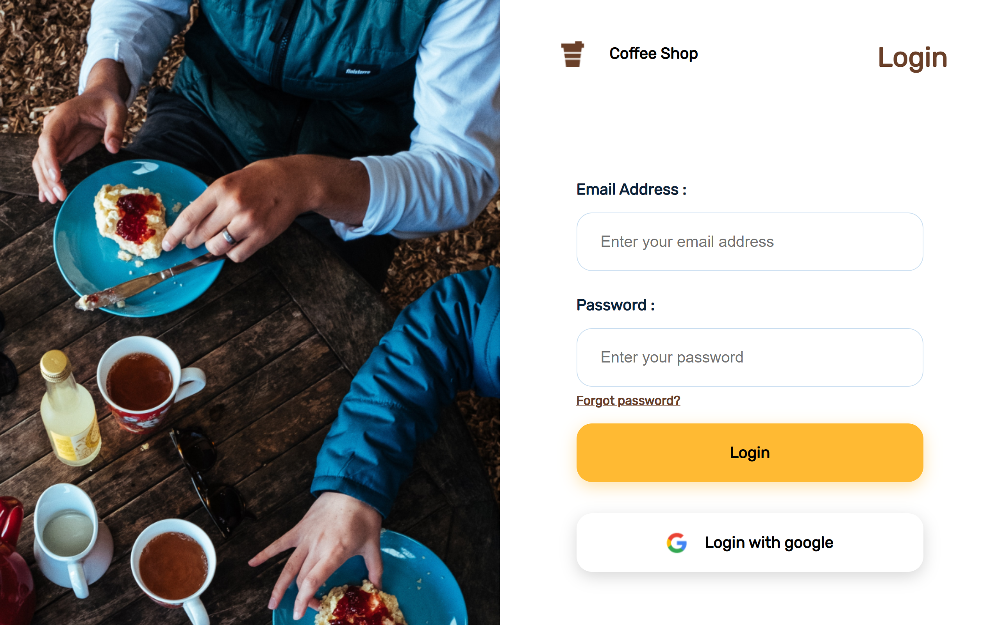
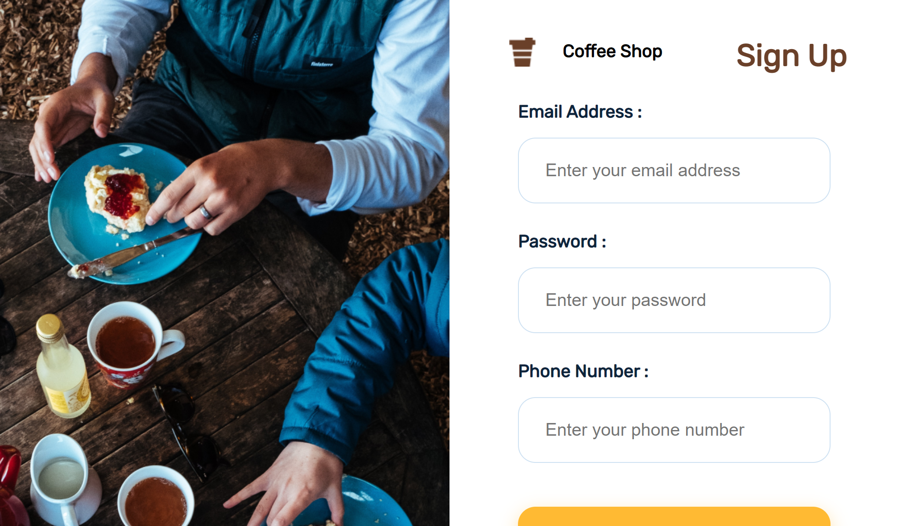
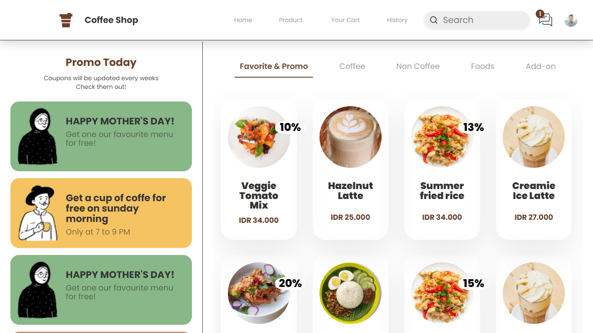
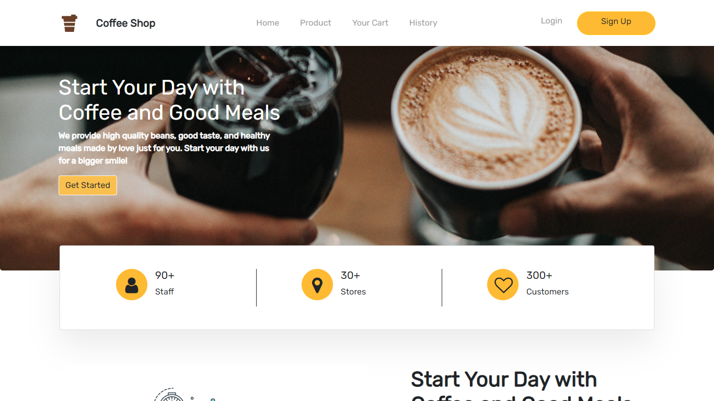

<h1 align="center"> Coffee Shop App </h1>

<div align="center">

</div>

<br/>

## Built with

<hr/>


## How to Install
1. Clone the Repository
    ```
    $ https://github.com/ghofarasnanto/client-coffeshop.git
    ```
2. Open [VS Code](https://code.visualstudio.com/download)

3. Install [Live Server Extension for VS Code](https://marketplace.visualstudio.com/items?itemName=ritwickdey.LiveServer)

4. Right click *index.html* then choose **open with Live Server**

<br />

## Preview

<hr/>

<div align="center" style="display:grid; grid-template-areas:'a b';">


</div>
<br />
<div align="center" style="display:grid; grid-template-areas:'a b';">


</div>
<br />
<div align="center" style="text-align:center">

</div>

<br />

## Related Project

<hr/>

[Link to backend (Soon)]()